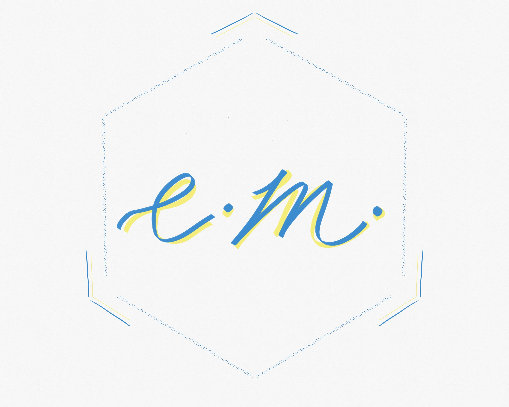

# EctoMorph

Morph between Ecto & JSON Schemas!

Use JSON Schemas to generate Ecto Schemas and Changesets that get evaluated
at runtime.

## Use Cases

#### Example 1: Injesting JSON data & Coercing to Elixir data

Some Api broadcasts messages that look like:

```elixir
%SomeMessage{
  id: "abcdefghijklmnop-uuid-imsosecure",
  type: "alert",
  data: %{
    priory_level: "high",
    occurred_at: ~N[2020-01-20]
  }
}
```

Our app is subscribed to these messages, and processes them:

```elixir
defmodule MyMessageCenter.MessageProcessor do
  def process(%SomeMessage{} = message) do
    # some super-duper heavy work
  end

  defp find_schema_for_message(%SomeMessage{type: "alert"}), do: AlertSchema
end
```

#### Example 2: Sharing Ecto Schemas across multiple applications

This project allows us to share Ecto Schemas between two applications without
a new mix dependency as long as both have `ecto_morph`. The json schema files
also act as contracts for both those applications


#### Example 3: API contracts as JSON schema

By using JSON Schemas as API contracts, we can validate parameters for a
Phoenix Controller using EctoMorph in Ecto. This allows us to follow the well
established pattern of validating request parameters using embedded schemas
while still being able to share them as JSON schema contracts with other
applications.
